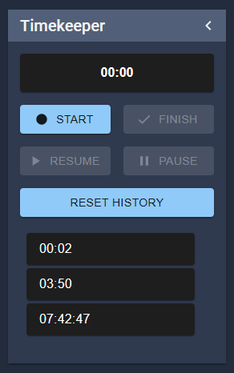
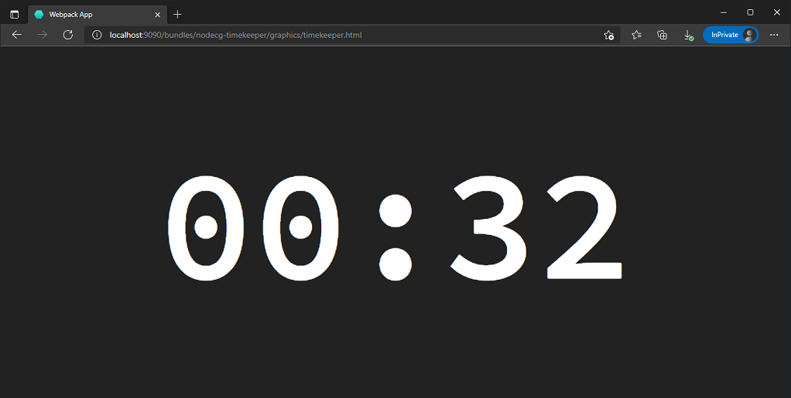

# nodecg-timekeeper

演目のタイムキーパーとして使えるシンプルなタイマーです.

# インストール

```
nodecg install cma2819/nodecg-timekeeper
```

# 設定

## defaultconfig

``` json
{
  "disableDashboardControl": false,
  "tickRateMs": 100
}
```

## プロパティ

### disableDashboardControl

- デフォルト: false
- これが `false` の場合, ダッシュボード上のコントロールを無効化します.
  - extension へのメッセージ経由の操作のみを許可したい場合に使ってください.

### tickRateMs

- デフォルト: 100
- 時間を更新するレートミリ秒を設定します.
- **注: このタイムキーパーは秒より小さい桁を保持しません.レートミリ秒を小さくしすぎると, 他の extension のパフォーマンスに影響することがあります.**

# Replicant schema

## Time データの構造

このバンドルでは共通の `Time` スキーマで時間を表現します.

- [schema](./schemas/lib/time.json)

|key|type|description|
|:--|:--|:--|
|display|string|(hh:)mm:ss 形式でフォーマットされた時間|
|rawInSecond|number|秒単位の時間|

## timekeeping

現在の経過時間とそのステータスを表現します.

- name: `timekeeping`
- type: object
- [schema](./schemas/timekeeping.json)

|key|type|description|
|:--|:--|:--|
|time|[Time](#time-データの構造)|現在の時間データ|
|status|`'paused'`\|`'in_progress'`\|`'finished'`|現在の進行ステータス|

## history

完了した時間を保持します.

- name: `history`
- type: [History](#history-オブジェクト) のリスト
- [schema](./schemas/history.json)

### History オブジェクト

|key|type|description|
|:--|:--|:--|
|time|[Time](#time-データの構造)|現在の時間データ|
|finishedAt|number|完了日時の [Date の数値](https://developer.mozilla.org/en-US/docs/Web/JavaScript/Reference/Global_Objects/Date/valueOf)|

# タイマーの操作

このバンドルはダッシュボード上のコントローラを実装しています.

加えてシンプルなメッセージリスナを提供します. `sendMessageToBundle` を使うことで, 自分のダッシュボードやグラフィックから操作することができます.

## dashboard

*簡単です.*



## messages

このバンドルのコントローラを使わずに自分のダッシュボードから操作したい場合, `disableDashboardControl: true` と設定することを推奨します.


メッセージについては[こちら](./docs/md/extension.md).

# Graphics

このバンドルはシンプルなグラフィックも備えています. これは配信オーバーレイとして使うものではありません. タイムキープのために, グラフィックの表示を共有する（Discord の画面共有など）か, URL を共有 **（NodeCG のアクセスを権限認可にしている場合にはリスキーな方法です）** してください.

